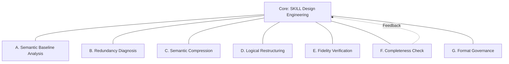
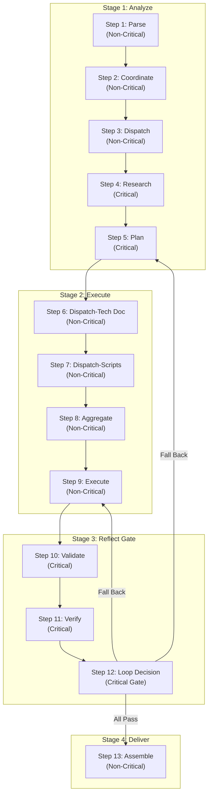
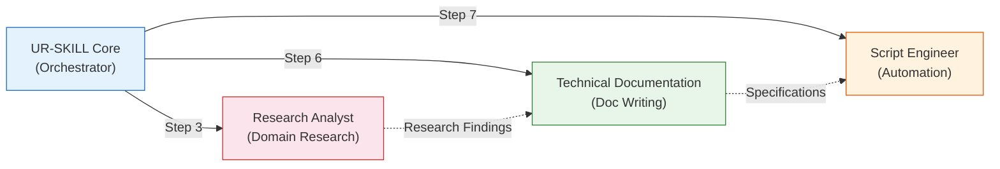

# UR-SKILL

<div align="center">

[](https://github.com/benbird316/UR-SKILL/actions/workflows/validate.yml)
[](https://github.com/benbird316/UR-SKILL/actions/workflows/validate.yml)
[](https://github.com/benbird316/UR-SKILL/actions/workflows/validate.yml)
[](https://www.python.org/)
[](../LICENSE)

**Methodology-Driven Meta-Skill Factory — Input a requirement, output a production-grade AI Agent skill package or system prompt**

</div>

---

**UR-SKILL turns fuzzy natural language requirements into structured, verifiable AI Agent skill packages or system prompts -- the project's own Chinese-English translation and documentation proofreading are done using translation skills produced by UR-SKILL itself (eating our own dog food).**

It is not yet another prompt template. It is a **factory**: a 4-stage, 13-step verified workflow x 6-dimension review x capability matrix that systematically designs, reviews, and produces production-grade skills. Generated skills pass 15+ automated quality checks before delivery. Fully compliant with the [agentskills.io](https://agentskills.io/specification) open standard.

---

## Table of Contents

- [Too Long; Didn't Read](#too-long-didnt-read)
- [Quick Start](#quick-start)
- [Core Concepts](#core-concepts)
- [Directory Structure](#directory-structure)
- [CLI Reference](#cli-reference)
- [Design Philosophy](#design-philosophy)
- [Contributing](#contributing)
- [License](#license)

---

## Too Long; Didn't Read

**The Problem**: Anyone can write a system prompt or Agent skill, but writing one with **stable quality and guaranteed floor** is hard.
- Boundaries not defined -> frequently oversteps
- Blind spots not identified -> fails on complex scenarios
- Conflicting rules -> AI doesn't know which one to follow
- Inconsistent across models -> pure trial and error

**The Solution**: UR-SKILL is not another prompt template -- it is an **industrial-grade system prompt / Agent skill factory**.
Input your requirements ("I need a prompt for an XX role" or "generate a XX SKILL for me"), and it automatically runs through 13 quality gates, producing a complete system prompt or structured SKILL package designed with capability matrices, 6-dimension review, and anti-pattern scanning. Individual developers can achieve enterprise-grade quality.

### Why UR-SKILL?

| Feature | Description |
|:---|:---|
| **Methodology-Driven** | Capability matrix + 4-stage verified workflow + 6-dimension review -- design decisions are traceable |
| **Automated Validation** | Python scripts check 15+ quality metrics, configurable false-positive rules |
| **Bilingual Support** | CN/EN dual versions, copy-and-use, compatible with major Agent platforms |
| **Self-Contained** | Each skill package runs independently, zero external dependencies |
| **Self-Iterating** | Eating our own dog food -- the project's own CN-EN translation and documentation proofreading use UR-SKILL-generated translation skills |

### Comparison

| Dimension | Hand-Written Prompts | Prompt Templates | Code Generators | **UR-SKILL** |
|:---|:---:|:---:|:---:|:---:|
| Structured Design | ❌ | ⚠️ | ✅ | ✅ |
| Verifiable Quality | ❌ | ❌ | ❌ | ✅ |
| Anti-Pattern Detection | ❌ | ❌ | ❌ | ✅ |
| Methodology System | ❌ | ❌ | ❌ | ✅ |
| Cross-Domain Reuse | ❌ | ⚠️ | ⚠️ | ✅ |

### Who Is It For

#### Core Users: Individual Developers & Beginners

**UR-SKILL is designed for you if:**

- You want to write great system prompts or SKILL packages for your AI Agent, but the quality is always inconsistent
- You don't know what a "good system prompt / SKILL" should contain -- where are the boundaries? How to handle blind spots? What about conflicting rules?
- You've read many prompt tips, but the result is still "usable but not solid" -- no quality floor guarantee
- You want to create a dedicated skill/role, but don't have the professional methodology of big-company prompt engineers
- You don't need to know everything -- just input your requirements and get **industrial-grade system prompts or structured SKILL packages with guaranteed quality floor**

> **In one sentence: Big companies hire professional teams to design from scratch; you have UR-SKILL to generate with one click.**

#### Advanced Users

| Role | Use Case | Quick Start |
|:---|:---|:---|
| **Prompt Engineer** | Audit existing system prompts / SKILLs -- identify blind spots, anti-patterns, boundary abuse | -> Paste any skill for analysis |
| **Open Source Maintainer** | Generate AI Agent entry points for your repo, lower the barrier for AI-driven contributions | -> Check real skill examples in examples/ |
| **Tech Lead** | Establish team-level skill quality standards with CI automated validation gates | -> Check CLI Reference |

### When NOT to Use UR-SKILL

- **You only need 5 lines of system prompt / simple skill** -- UR-SKILL's 13-step workflow is overkill, just write it by hand
- **Your platform does not support sub-agents** -- the workflow degrades to inline execution, losing parallel optimization
- **You are new to AI Agents** -- learn SKILL/Agent basics first, then apply formal methodology
- **You need application code, not Agent prompts** -- UR-SKILL produces skill definitions, not runnable software

---

## Quick Start

### Prerequisites

- AI Agent platform supporting SKILL (Trae / Claude Code / Cursor / Windsurf / CodeBuddy / VS Code Copilot, etc.)
  - Generated SKILLs follow the agentskills.io open standard by default, cross-platform compatible
  - See `design-guides/skill-package-design-guide.md §A Platform Adaptation Appendix` for details
- Python 3.12+ (only needed for running validation scripts)

### Three Steps to Start

#### 1. Clone the Repository

```bash
git clone https://github.com/benbird316/UR-SKILL.git
cd UR-SKILL
```

#### 2. Copy the SKILL Package to Your Skills Directory

Choose a language version (`UR-SKILL-CN/` or `UR-SKILL-EN/`) and copy it to your platform's skills directory:

| Platform | Skills Directory |
|:---|:---|
| **Trae** | `%USERPROFILE%\.trae\skills\` or `%USERPROFILE%\.trae-cn\skills\` |
| **Claude Code** | `~/.claude/skills/` (Linux/macOS); `%USERPROFILE%\.claude\skills\` (Windows) |
| **Cursor** | `%APPDATA%\Cursor\User\skills\` (Windows); `~/.cursor/skills/` (macOS/Linux) |
| **VS Code Copilot** | `.github/skills/` (project-level) |
| **Cline** | `%USERPROFILE%\.cline\skills\` |
| **Windsurf** | `%USERPROFILE%\.windsurf\skills\` |
| **CodeBuddy** | `%USERPROFILE%\.codebuddy\skills\` |
| **UI-deploy platforms** | Create a new skill in the platform UI and paste `SKILL.md` content |

```bash
# Example: Install English version to Claude Code on macOS/Linux
cp -r UR-SKILL-EN ~/.claude/skills/ur-skill

# Example: Install Chinese version to Trae CN on Windows
xcopy UR-SKILL-CN %USERPROFILE%\.trae-cn\skills\ur-skill\ /E /I
```

#### 3. Deploy Sub-Agents

UR-SKILL's workflow depends on 3 sub-agents. Copy them to your platform's agents directory:

```bash
# Trae:
cp UR-SKILL-EN/agent/research-analyst.md .trae/agents/
cp UR-SKILL-EN/agent/tech-documentation.md .trae/agents/
cp UR-SKILL-EN/agent/script-engineer.md .trae/agents/

# Claude Code:
cp UR-SKILL-EN/agent/*.md .claude/agents/

# Cursor:
cp UR-SKILL-EN/agent/*.md .cursor/agents/

# UI-deploy platforms: create each agent/*.md as a separate agent via the platform UI
# See design-guides/skill-package-design-guide.md §A.5 for all platforms
```

> If sub-agents are not deployed, UR-SKILL degrades to inline execution mode -- core functionality is preserved but parallel acceleration is lost.

### Two Usage Modes

#### Mode One: Generate System Prompts (Simplest, Recommended for Beginners)

**UR-SKILL always runs the full SKILL workflow to produce a skill package.** A "system prompt" is an output variant of the SKILL package -- same workflow, just with metadata (frontmatter) and reference files stripped at the end, yielding a plain-text prompt that can be copied directly into any platform.

> How to trigger: Explicitly request a "system prompt" and UR-SKILL will auto-detect and perform the stripping.
>
> **The key is to be explicit**: `"Following UR-SKILL skill requirements, generate a system prompt for XXX"`

| Sub-mode | Trigger Example |
|:---|:---|
| **A -- Generate from Scratch** | `"Following UR-SKILL skill requirements, generate a system prompt for Python code review"` |
| **B -- Optimize Existing** | `"Here's my current prompt, optimize it following UR-SKILL skill requirements: [paste]"` |

> Examples:
> - *"Following UR-SKILL skill requirements, generate a code review system prompt specialized in security vulnerability detection"*
> - *"Following UR-SKILL skill requirements, optimize my customer service prompt for stronger boundaries"*

> **Note**: If you do not explicitly request a "system prompt", UR-SKILL defaults to producing a complete SKILL package (including capability matrix, workflow, rules, reference files, etc.) ready for deployment to SKILL-supporting Agent platforms.

#### Mode Two: Produce SKILL Packages (Advanced)

**Outputs a complete structured SKILL package**, including YAML metadata, capability matrix, workflow, rule system, ready to deploy to SKILL-supporting Agent platforms, optionally with validation scripts, reference files, and other attachments.

| Sub-mode | Trigger Condition | Execution Content |
|:---|:---|:---|
| **A -- Generate from Scratch** | `"I need a Python security code review SKILL"` | Full workflow: research domain, design capability matrix, produce complete skill package |
| **B1 -- External Skill Optimization** | Paste a skill from Cursor / Claude Code / any platform | Deconstruct existing skill, run gap analysis against UR-SKILL standards, rebuild as complete system |
| **B2 -- Internal Skill Optimization** | `"Optimize my cn-en-tech-translator skill"` | 6-dimension audit, anti-pattern scan, rule reinforcement, upgrade existing UR-SKILL skill |
| **C -- Knowledge Extraction** | `"Generate a SKILL for this domain based on this document"` | Read knowledge source -> extract domain facts -> build skill encoding that domain knowledge |

**No need to specify mode manually** -- the pre-analysis engine automatically identifies and routes based on content characteristics.

---

## Core Concepts

### Capability Matrix

At the core is the **capability matrix** -- 1 core domain + 6 radiating domains, each at 4 progressive layers. These are not workflow steps but independent knowledge domains.



### Validation Workflow (4 Stages x 13 Steps)



Critical checkpoints (Research, Plan, Validate, Verify, Loop Decision) use **all 6 dimensions**. Non-critical checkpoints use 3 dimensions.

### 6-Dimension Review

| Dimension | Review Content |
|:---|:---|
| **Goal Alignment** | Does the output match user requirements? |
| **Fact Anchoring** | Are conclusions supported by evidence (not fabricated)? |
| **Direction Calibration** | Has the design deviated from the core task? |
| **Adversarial Validation** | Challenge the design from an opposing perspective |
| **Blind Spot Identification** | Three-layer progression: self-fix -> request resources -> blind-spot report |
| **Impact Projection** | How does the current design decision affect subsequent steps? |

### Progressive Loading

| Layer | Content | Token Budget |
|:---|:---|:---|
| L1 | YAML frontmatter (name/description/metadata) | ~100 tokens |
| L2 | SKILL.md body (identity, capability matrix, workflow, rules) | <5,000 tokens |
| L3 | Reference files (loaded on demand: glossary, anti-patterns, troubleshooting) | On demand |

### Choosing Skill Package Mode

UR-SKILL adjusts output based on your requirements:

| Mode | Content | Use Case |
|:---|:---|:---|
| **Lite** | SKILL.md only | Quick prototyping, simple prompts, single-concept skills |
| **Standard** | SKILL.md + references/ | Domain skills requiring external standards, glossaries, or anti-pattern references |
| **Full** | Standard + assets/ | Production-grade skills with templates or multi-platform deployment |

UR-SKILL automatically determines the mode. If the skill references external standards or domain terminology, references/ is added automatically. If templates are needed, assets/ is included automatically.

### Multi-Agent Architecture

UR-SKILL orchestrates 3 specialized sub-agents in a collaborative pipeline:



| Sub-Agent | Role | Invocation Timing |
|:---|:---|:---|
| **Research Analyst** | Domain research, capability architecture, risk analysis | Analysis phase (Steps 2-5) |
| **Technical Documentation Engineer** | Skill body design, rule writing, format compliance | Execution phase (Step 6) |
| **Script Engineer** | Validation scripts, automation, CI integration | Execution phase (Step 7) |

Sub-agents in the execution phase run in parallel; tech documentation and script engineers work concurrently.

---

## Directory Structure

```
UR-SKILL/
├── README.md              # You are here
├── CONTRIBUTING.md        # Contribution guide
├── CHANGELOG.md           # Version history
├── LICENSE                # Apache 2.0
├── tests/                 # Unit tests (135 tests)
│   ├── conftest.py
│   ├── test_common.py
│   ├── test_config_loader.py
│   ├── test_validator_format.py
│   ├── test_validator_content.py
│   ├── test_validator_runtime.py
│   ├── test_bilingual_sync.py
│   ├── test_validate_skill.py
│   ├── test_generated_skill.py
│   └── test_self_validate.py
├── Scripts/
│   └── ci_validate_examples.py  # CI integration tests
├── .github/workflows/
│   └── validate.yml       # CI: auto-validation + integration tests + bilingual sync
│
├── UR-SKILL-CN/           # Chinese version (self-contained skill package)
│   └── ...                # Contains Scripts/, tests/, agent/, etc.
│
├── UR-SKILL-EN/           # English version (self-contained skill package)
│   ├── SKILL.md
│   ├── agent/               # 3 sub-agents: Research Analyst, Technical Documentation, Script Engineer
│   ├── templates/           # Templates for generating skills
│   ├── design-guides/       # Design methodology guides
│   ├── References/          # Glossary + anti-patterns + troubleshooting
│   ├── design-rationale/    # Design rationale explanations
│   └── assets/              # Asset files (templates, examples)
│
└── Examples/              # Production-grade skills generated by UR-SKILL
    └── cn-en-tech-translator/   # Chinese-to-English tech translation skill (dogfood: the project's own bilingual translation uses this)

```

**Key Design Decisions**:
- The Chinese and English versions are **independent, self-contained skill packages** -- either can be used separately
- The English version focuses on the core skill definition and supporting reference file set, excluding validation scripts and test suites (which are centralized in the Chinese version)
- `tests/` is a single test suite covering both language configurations, `ci_validate_examples.py` provides end-to-end pipeline validation

---

## CLI Reference

### `validate_skill.py`

| Parameter | Description | Example |
|:---|:---|:---|
| `--skill-dir <path>` | Skill package directory | `--skill-dir UR-SKILL-EN` |
| `--lang zh-cn\|en-us` | Validation language | `--lang en-us` |
| `--format text\|json` | Output format | `--format json` |

### `bilingual_sync.py`

Check structural consistency between CN/EN directories:

```bash
python UR-SKILL-CN/Scripts/bilingual_sync.py
```

---

## Design Philosophy

1. **Methodology First, Not Template First** -- Templates are for filling in; methodology guides how to fill
2. **Progressive Loading** -- U-shaped attention curve; three-layer loading places information at optimal positions
3. **Rule-Driven (RFC 2119)** -- MUST/SHOULD/MAY grading, no vague recommendations
4. **Blind Spot Three-Layer Progression** -- Self-fix -> Request resources -> Blind-spot report; no skipping levels
5. **Identity Humility** -- Research confirms that labels like "expert" and "years of experience" degrade model performance

---

## Contributing

Contributions are welcome! See [CONTRIBUTING.md](../CONTRIBUTING.md) for the full guide.

```bash
# Quick start for contributors
git clone https://github.com/benbird316/UR-SKILL.git
cd UR-SKILL
pip install pyyaml pytest
python -m pytest tests/ -v
```

All PRs must pass validation before merging.

---

## License

[Apache 2.0](../LICENSE) -- Protects the methodology from closed-source redistribution under the same name while remaining permissive enough for community use.

---

## Acknowledgements

- [Anthropic](https://www.anthropic.com/) -- Claude platform and SKILL concept
- [RFC 2119](https://www.ietf.org/rfc/rfc2119.txt) -- Rule grading keyword standard
- USC ICT & Wharton -- Research on the impact of identity inflation on LLM performance
