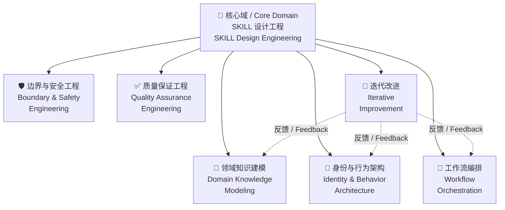
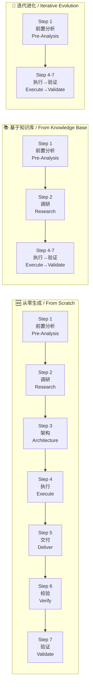

# UR-SKILL
*Methodology-Driven Meta-SKILL Factory / 方法论驱动的元 SKILL 工厂*

[](LICENSE)
[](Scripts/validate_skill.py)

---
**UR-SKILL 将模糊的自然语言需求转化为结构化、可执行、可验证的 AI Agent SKILL 文件包。**
*UR-SKILL transforms vague natural-language requirements into structured, executable, verifiable AI Agent SKILL packages.*

**它不是又一个提示词模板——它是一套方法论驱动的工厂，用 6 个独立能力域 + 7 步校验工作流，系统性地设计、审查和产出高质量的 SKILL。**
*It's not another prompt template — it's a methodology-driven factory that uses 6 independent capability domains and a 7-step verified workflow to systematically design, review, and produce high-quality SKILLs.*

**UR-SKILL 吃自己的狗粮：UR-SKILL 自身就是用自己的方法论生成的 SKILL。**
*UR-SKILL eats its own dog food: UR-SKILL itself is a SKILL generated using its own methodology.*

---
## 这是什么？ / What Is This?

**问题 / The Problem**

写一个好的 AI Agent 系统提示词很难。不是"写不出来"，而是——写出来以后，你没法系统地判断它好不好。能力边界在哪？有没有盲区？规则之间会不会冲突？换了模型还能用吗？
*Writing a good AI Agent system prompt is hard. Not because you can't write one — but because once you write it, you can't systematically judge its quality. Where are the capability boundaries? Are there blind spots? Do rules conflict? Will it work on a different model?*

**方案 / The Solution**

UR-SKILL 是一套方法论驱动的元 SKILL 工厂——它不是直接回答你的问题，而是引导你（或 AI agent）通过一个结构化流程，产出完整的 SKILL 文件包：
*UR-SKILL is a methodology-driven meta-SKILL factory — it doesn't answer your question directly. It guides you (or an AI agent) through a structured process to produce a complete SKILL package:*

| 产出物 / Output | 说明 / Description |
|:---|:---|
| `SKILL.md` | 主入口，含 YAML metadata + 能力矩阵 + 工作流 + 规则 / Main entry with YAML metadata + capability matrix + workflow + rules |
| `agent/SKILL.md` | 前置分析子 SKILL（强制阶段）/ Pre-analysis sub-SKILL (mandatory stage) |
| `templates/` | 14 个模板（身份、工作流、边界、反模式等）/ 14 templates (identity, workflow, boundary, anti-patterns, etc.) |
| `design-guides/` | 15+ 份设计指南 / 15+ design guides |
| `References/` | 术语表 + 反模式库 + 故障诊断 / Glossary + anti-pattern library + troubleshooting |
| `Scripts/` | Python 校验脚本，静态检查生成的 SKILL 质量 / Python validation script for static quality checks |

**核心差异 / Core Difference**

大多数"写提示词"的工具给你的是一个模板。UR-SKILL 给你的是一个**工厂**——同一套方法论，可以产出安全审查 SKILL、代码审查 SKILL、文档优化 SKILL，或者任何其他领域的 Agent SKILL。上面的 `tech-doc-optimizer` 就是用 UR-SKILL 生产的真实产物。
*Most "prompt writing" tools give you a template. UR-SKILL gives you a factory — the same methodology can produce a security audit SKILL, a code review SKILL, a document optimization SKILL, or any other domain-specific Agent SKILL. The `tech-doc-optimizer` referenced above is a real product manufactured by UR-SKILL.*

---
## 架构 / Architecture

UR-SKILL 的核心是一个**能力矩阵（Capability Matrix）**——1 个核心领域 + 6 个辐射领域，每个领域有 4 层深度。这不是工作流步骤，而是独立的知识域。
*UR-SKILL's core is a Capability Matrix — 1 core domain + 6 radiating domains, each with 4 layers of depth. These are not workflow steps; they are independent knowledge domains.*



**6 个辐射领域通过排序测试和三问筛选**——重新排序不会导致逻辑坍塌，每个领域独立、不可替代、与核心域互补。不是工作流别名。
*The 6 radiating domains pass the Ordering Test and Three-Question Screening — reordering does not cause logical collapse; each domain is independent, irreplaceable, and complementary to the core. These are not workflow aliases.*

---
## 工作流 / Workflow

UR-SKILL 通过 7 步校验工作流生成 SKILL，并支持 **3 种生成路线**：
*UR-SKILL generates SKILLs through a 7-step verified workflow, supporting 3 generation routes:*



| 路线 / Route | 触发条件 / Trigger | 走哪些步骤 / Steps Used |
|:---|:---|:---|
| **A. 从零生成 / From Scratch** | 用户提出全新需求，无现有 SKILL 可参考 / User proposes entirely new requirement, no existing SKILL to reference | 全部 7 步 / Full 7 steps |
| **B. 基于知识库 / From Knowledge Base** | 用户提供知识源（文档、wiki、规范），从知识中提取能力域 / User provides knowledge sources (docs, wiki, specs), extract domains from knowledge | Step 1-2 + Step 4-7（跳过架构，知识源已隐含结构）/ Step 1-2 + Step 4-7 (skip Architecture, knowledge source implies structure) |
| **C. 迭代进化 / Iterative Evolution** | 用户已有 SKILL，需要优化、修复或补全 / User has an existing SKILL that needs optimization, fixing, or completion | Step 1 + Step 4-7（跳过调研和架构，聚焦优化）/ Step 1 + Step 4-7 (skip Research and Architecture, focus on optimization) |

**每个步骤都有检查清单，关键节点（调研、架构、校验、验证）6 维全开。**
*Every step has a checklist. Critical checkpoints (Research, Architecture, Verify, Validate) use all 6 review dimensions.*

---
## 快速开始 / Quick Start

**前置条件 / Prerequisites**

- 一个支持 SKILL 调用的 AI Agent 平台（Trae IDE / Claude Code / Cursor / 等）
- Python 3.8+（仅运行校验脚本时需要）
- *An AI Agent platform that supports SKILL invocation (Trae IDE / Claude Code / Cursor / etc.)*
- *Python 3.8+ (only needed to run the validation script)*

**最简使用 / Minimal Usage**

触发 UR-SKILL，输入你的需求：
*Invoke UR-SKILL with your requirement:*

> "我需要一个代码审查 SKILL，专用于 Python 项目的安全漏洞检测"
> *"I need a code review SKILL specifically for Python security vulnerability detection"*

UR-SKILL 会执行前置分析（自动判定复杂度、推导能力域），然后按工作流产出完整的 SKILL 文件包。
*UR-SKILL will execute pre-analysis (auto-determine complexity, derive capability domains), then produce a complete SKILL package through the workflow.*

**输出校验 / Validate Output**

```bash
cd UR-SKILL  # 或你的项目目录 / or your project directory
python Scripts/validate_skill.py
```

校验脚本会检查 15 项质量指标：第一人称残留、身份膨胀、工作流检查项数量、维度覆盖、占位符残留、风险边界滥用等。
*The validation script checks 15 quality indicators: first-person residue, identity inflation, workflow check item counts, dimension coverage, placeholder residue, risk boundary abuse, and more.*

---
## 真实案例：tech-doc-optimizer / Real-World Example

**UR-SKILL 生成的 `tech-doc-optimizer` 是一个技术文档无损语义优化 SKILL。它正是用 UR-SKILL 方法论生产的，用来优化 UR-SKILL 自己的文档。**
*The `tech-doc-optimizer` generated by UR-SKILL is a lossless semantic optimization SKILL for technical documentation. It was produced using UR-SKILL's methodology — and was used to optimize UR-SKILL's own documentation.*

| 结构特征 / Structure | tech-doc-optimizer |
|:---|:---|
| YAML frontmatter（name/description/type/whenToUse） | ✅ |
| Identity block + Safety Guardrail | ✅ |
| Capability Matrix（1 Core + 7 Radiating Domains） | ✅ |
| Foundation / Advanced / Expert / Extension 四层 | ✅ |
| Ordering Test + Three-Question Screening | ✅ |
| 7-Step Workflow | ✅ |
| Anti-Patterns (AP-01–AP-10) | ✅ |
| Glossary（17 个术语）/ 17 terms | ✅ |
| Troubleshooting + Knowledge-Reference + Examples | ✅ |

**自己吃自己的狗粮**：tech-doc-optimizer 生成后，我们用它来优化 UR-SKILL 自己的 design-guides、references 和 SKILL.md，形成闭环的自我迭代。
*Dogfooding: after tech-doc-optimizer was generated, we used it to optimize UR-SKILL's own design-guides, references, and SKILL.md — forming a closed-loop self-iteration.*

你也可以用 UR-SKILL 生成一个 SKILL 后，再用 tech-doc-optimizer（或你自己生成的校验 SKILL）对它进行术语对齐、结构对齐和语义冗余分析——工厂产出的零件也可以上质检台。
*You can also generate a SKILL with UR-SKILL, then run it through tech-doc-optimizer (or your own verification SKILL) for terminology alignment, structure alignment, and semantic redundancy analysis — parts from the factory can go through the QA bench too.*

---
## 核心概念 / Core Concepts

**能力域 ≠ 工作流步骤 / Capability Domains ≠ Workflow Steps**

这是 UR-SKILL 最核心的设计原则。能力域是**独立的知识体**（如"边界与安全工程"），工作流是**顺序的执行过程**（如 Step 1→Step 7）。每个工作流步骤调用多个能力域的知识，而不是一个步骤对应一个域。
*This is UR-SKILL's most fundamental design principle. Capability domains are independent knowledge bodies (e.g., "Boundary & Safety Engineering"); workflows are sequential execution processes (e.g., Step 1→Step 7). Each workflow step calls on knowledge from multiple domains — it's not a one-to-one mapping.*

**6 维审查 / 6 Review Dimensions**

| 维度 / Dimension | 审视什么 / What It Reviews |
|:---|:---|
| 目标对齐 / Goal Alignment | 产出是否符合用户原始需求 / Does output match original user requirements? |
| 事实锚定 / Fact Anchoring | 产出是否有事实依据（非臆造） / Is output fact-based (not fabricated)? |
| 方向校准 / Direction Calibration | 设计方向是否正确（未偏离核心任务） / Is design direction correct (no drift from core task)? |
| 对抗验证 / Adversarial Validation | 从反方视角质疑设计合理性 / Challenge design from adversarial perspective |
| 盲区识别 / Blind Spot Identification | 三层递进：调查自修 → 请求资源 → 盲区报告 / Three-tier escalation: self-repair → request resources → blind spot report |
| 影响投射 / Impact Projection | 当前设计对其他模块/后续步骤的影响 / Impact of current design on other modules and downstream steps |

**渐进式加载 / Progressive Loading**

不把全部知识一次性塞给模型。UR-SKILL 采用三层渐进式加载：
*Don't dump all knowledge on the model at once. UR-SKILL uses three-layer progressive loading:*

| 层级 / Layer | 内容 / Content | Token 预算 / Budget |
|:---|:---|:---|
| L1 | YAML frontmatter（name/description/type/whenToUse） | ~100 |
| L2 | SKILL.md body（身份、能力矩阵、工作流、规则、边界） | <5000 |
| L3 | References（按需加载：术语表、反模式、故障诊断、设计原理） | 按需 / On-demand |

**反模式体系 / Anti-Pattern System**

UR-SKILL 内置 11 个反模式，覆盖设计阶段最常见的错误——从"能力域写成工作流别名"到"身份膨胀（专家/教授/多年经验）"。每个反模式都有"为什么看起来是好意图→为什么有害→如何避免"三段论证。
*UR-SKILL has 11 built-in anti-patterns covering the most common design-stage mistakes — from "capability domains as workflow aliases" to "identity inflation (expert/professor/years of experience)." Each anti-pattern includes a three-part argument: why it looks like a good intention → why it's harmful → how to avoid it.*

---
## 文件结构 / File Structure

```
UR-SKILL/
├── README.md                    # 你在这里 / You are here
├── LICENSE                      # Apache 2.0
├── CHANGELOG.md                 # 变更日志 / Changelog
├── .gitignore
├── UR-SKILL-CN/                 # 中文版 / Chinese edition
│   ├── SKILL.md                 # 主 SKILL 入口 / Main SKILL entry point
│   ├── agent/
│   │   └── SKILL.md             # 前置分析子 SKILL / Pre-analysis sub-SKILL
│   ├── templates/               # 14 个模板 / 14 templates
│   │   ├── capability-architecture-template.md
│   │   ├── workflow-template.md
│   │   ├── rules-template.md
│   │   ├── boundary-template.md
│   │   ├── identity-template.md
│   │   ├── output-template.md
│   │   ├── examples-template.md
│   │   ├── anti-patterns-template.md
│   │   ├── glossary-template.md
│   │   ├── troubleshooting-template.md
│   │   ├── knowledge-reference-template.md
│   │   ├── scripts-template.md
│   │   ├── assets-template.md
│   │   └── metadata-spec.md
│   ├── design-guides/           # 15+ 设计指南 / 15+ design guides
│   │   ├── capability-design-guide.md
│   │   ├── tool-invocation-design-guide.md
│   │   ├── output-content-design-guide.md
│   │   ├── structure-guideline.md
│   │   ├── boundary-design-guide.md
│   │   ├── identity-design-guide.md
│   │   ├── rules-design-guide.md
│   │   ├── examples-design-guide.md
│   │   ├── anti-patterns-design-guide.md
│   │   ├── glossary-design-guide.md
│   │   ├── troubleshooting-design-guide.md
│   │   ├── knowledge-reference-design-guide.md
│   │   ├── scripts-design-guide.md
│   │   ├── assets-design-guide.md
│   │   ├── spec-design-guide.md
│   │   └── model-format-adaptation-design-guide.md
│   ├── References/              # 参考资料 / Reference materials
│   │   ├── glossary.md          # 术语表（G01-G80）/ Glossary
│   │   ├── anti-patterns.md     # 反模式库 / Anti-pattern library
│   │   └── troubleshooting.md   # 故障诊断（T01-T17）/ Troubleshooting
│   ├── design-rationale/        # 设计原理 / Design rationale
│   │   └── design-rationale.md
│   ├── examples/
│   │   └── examples.md
│   └── Scripts/
│       └── validate_skill.py    # 质量校验脚本 / Quality validation script
├── UR-SKILL-EN/                 # 英文版 / English edition（结构与 CN 镜像 / mirrors CN）
│   └── ...（同上 / same structure）
└── Examples/                    # 用 UR-SKILL 生产的真实 SKILL / Real SKILLs manufactured by UR-SKILL
    └── tech-doc-optimizer/      # 技术文档无损语义优化 / Technical doc lossless semantic optimizer
        ├── SKILL.md
        └── references/
```

**中英双语 / Bilingual**

CN 与 EN 两个子目录结构完全对齐，根目录放置发布文件（README / LICENSE / CHANGELOG / .gitignore）。
*CN and EN subdirectory structures are fully aligned. Publishing files (README / LICENSE / CHANGELOG / .gitignore) live at the root level.*

---
## 设计哲学 / Design Philosophy

**1. 方法论优先，而非模板优先 / Methodology First, Not Template First**

模板是你填的，方法论是指导你怎么填的。UR-SKILL 提供的是后者。
*A template is what you fill in; methodology is what guides you on how to fill it in. UR-SKILL provides the latter.*

**2. 渐进式加载 / Progressive Loading**

U 型注意力曲线 → 模型对 prompt 开头和结尾的内容关注度最高，中间内容容易被稀释。三层渐进式加载确保高价值信息在最有效的位置。
*U-shaped attention curve → models pay most attention to the beginning and end of a prompt; middle content gets diluted. Three-layer progressive loading ensures high-value information sits at the most effective positions.*

**3. 规则驱动，而非建议驱动 / Rule-Driven, Not Suggestion-Driven**

全项目使用 RFC 2119 关键词（MUST/MUST NOT/SHOULD/SHOULD NOT/MAY）。模型对"建议"类措辞的执行率远低于"必须"类措辞。
*The entire project uses RFC 2119 keywords (MUST/MUST NOT/SHOULD/SHOULD NOT/MAY). Models execute "suggestion"-style language at a much lower rate than "must"-style language.*

**4. 盲区三级递进，禁止跳层 / Blind Spot Three-Tier Escalation, No Skipping**

遇到知识盲区 → 调查自修（利用已有资料）→ 请求资源（向用户索要）→ 盲区报告（记录但不阻塞交付）。禁止从"不知道"直接跳到"放弃"。
*Hit a knowledge blind spot → self-repair (use existing resources) → request resources (ask user) → blind spot report (record but don't block delivery). Never jump from "don't know" to "give up."*

**5. 身份谦逊 / Identity Humility**

研究发现（USC 2026.3, Wharton 2025.12）：给模型加"专家""教授""多年经验"等身份标签，反而降低性能。UR-SKILL 禁止任何膨胀的身份声明。
*Research shows (USC 2026.3, Wharton 2025.12): giving models identity labels like "expert," "professor," or "years of experience" actually degrades performance. UR-SKILL prohibits all inflated identity declarations.*

---
## 贡献 / Contributing

UR-SKILL 欢迎贡献。贡献方式包括：
*UR-SKILL welcomes contributions. Ways to contribute:*

- **用 UR-SKILL 生成 SKILL**，反馈使用体验 / *Generate SKILLs with UR-SKILL and share your experience*
- **改进设计指南**——任何方法论层面的优化 / *Improve design guides — any methodology-level optimization*
- **提交你发现的故障案例**到反模式库或故障诊断 / *Submit troubleshooting cases to the anti-pattern library or troubleshooting guide*
- **翻译到更多语言** / *Translate to more languages*

提交前请运行校验脚本确保质量：
*Run the validation script before submitting to ensure quality:*

```bash
python Scripts/validate_skill.py
```

---
## 许可证 / License

[Apache 2.0](LICENSE) — 保护方法论不被闭源篡改后以相同名义分发，同时保持足够宽松让社区自由使用。
*[Apache 2.0](LICENSE) — protects the methodology from being closed-sourced and redistributed under the same name, while remaining permissive enough for free community use.*

---
## 致谢 / Acknowledgments

- [Anthropic](https://www.anthropic.com/) — Claude 平台与 SKILL 概念 / Claude platform and SKILL concept
- [RFC 2119](https://www.ietf.org/rfc/rfc2119.txt) — 规则关键词标准 / Rule keyword standard
- USC ICT & Wharton — 身份膨胀对 LLM 性能影响的研究 / Research on identity inflation's impact on LLM performance
