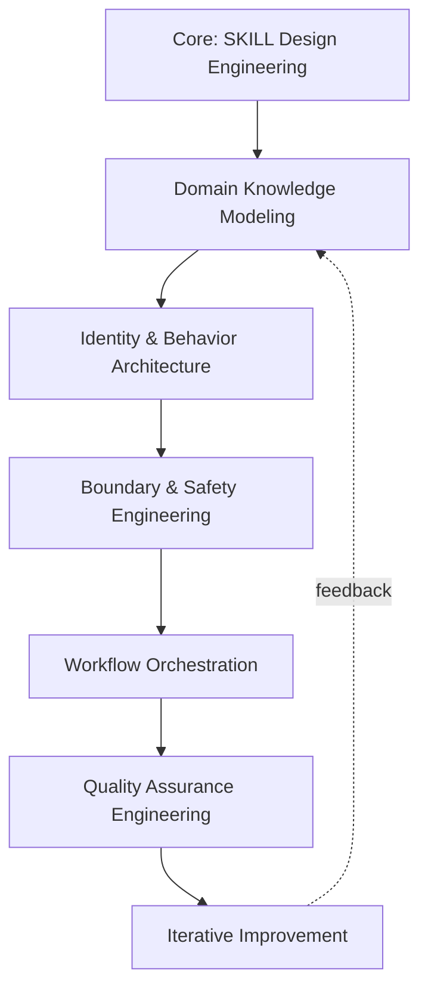
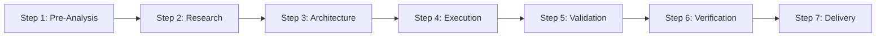

# UR-SKILL

<div align="center">

[](https://github.com/benbird316/UR-SKILL/actions/workflows/validate.yml)
[](https://github.com/benbird316/UR-SKILL/tree/main/tests)
[](https://www.python.org/)
[](LICENSE)

**Methodology-Driven Meta-SKILL Factory**

</div>

---

**UR-SKILL turns vague natural-language requirements into structured, verifiable AI Agent SKILL packages — using a methodology the project itself was built with (eat your own dog food).**

It's not another prompt template. It's a **factory**: a 7-step verified workflow × 6-domain perspective × capability matrix that systematically designs, reviews, and produces production-grade SKILLs. Generated SKILLs pass 15+ automated quality checks before delivery. Fully compliant with the [agentskills.io](https://agentskills.io/specification) open standard.

---

## Table of Contents

- [TL;DR](#tldr)
- [Quick Start](#quick-start)
- [Core Concepts](#core-concepts)
- [Directory Structure](#directory-structure)
- [Installation](#installation)
- [CLI Tools Reference](#cli-tools-reference)
- [Design Philosophy](#design-philosophy)
- [Contributing](#contributing)
- [License](#license)

---

## TL;DR

**The problem**: Writing a good AI Agent system prompt isn't hard — systematically judging its quality is. Where are the capability boundaries? Any blind spots? Rule conflicts? Does it still work when switching models?

**The solution**: UR-SKILL doesn't give you a template — it gives you a **factory**. The same methodology can produce a security audit SKILL, a code review SKILL, a documentation optimizer SKILL, or any domain-specific Agent SKILL.

### Why UR-SKILL?

| Feature | Description |
|:---|:---|
| **Methodology-Driven** | Capability matrix + 7-step workflow + 6-dimension review — traceable design decisions |
| **Automated Validation** | Python script checks 15+ quality metrics, configurable false-positive rules |
| **Bilingual** | CN/EN dual versions, one-click deployment to 39 agent platforms |
| **Self-Contained** | Each SKILL package runs independently, zero external dependencies |
| **Self-Iterating** | Eat your own dog food — generated SKILLs optimize the project's own documentation |

### Comparison

| Dimension | Hand-Written Prompt | Prompt Template | Code Generator | **UR-SKILL** |
|:---|:---:|:---:|:---:|:---:|
| Structured Design | ❌ | ⚠️ | ✅ | ✅ |
| Verifiable Quality | ❌ | ❌ | ❌ | ✅ |
| Anti-Pattern Detection | ❌ | ❌ | ❌ | ✅ |
| Methodology System | ❌ | ❌ | ❌ | ✅ |
| Cross-Domain Reuse | ❌ | ⚠️ | ⚠️ | ✅ |

### Who Is This For

| Role | How to Use UR-SKILL |
|:---|:---|
| **AI Agent Developer** | Load UR-SKILL in Claude Code / Cursor / Trae, describe your needs, get a production-grade SKILL |
| **Prompt Engineer** | Audit existing system prompts with the methodology — identify blind spots, anti-patterns, boundary abuse |
| **Open Source Maintainer** | Generate standardized AI Agent interaction entry points for your project, lowering AI-driven contribution barriers |
| **Tech Lead** | Establish team-wide SKILL quality standards with CI-automated validation gates |

> **You don't need to be a Prompt expert** — UR-SKILL encodes expert knowledge into the methodology. You just describe what you need.

---

## Quick Start

### Prerequisites

- An AI Agent platform with SKILL support (Trae IDE / Claude Code / Cursor / etc.)
- Python 3.12+ (only needed for running the validation script)

### Three Steps

```bash
# 1. Clone
git clone https://github.com/benbird316/UR-SKILL.git
cd UR-SKILL

# 2. Self-validate (verify everything works)
pip install pyyaml pytest
python -m pytest tests/ -v
python UR-SKILL-CN/Scripts/validate_skill.py --skill-dir UR-SKILL-CN --lang zh-cn
python UR-SKILL-EN/Scripts/validate_skill.py --skill-dir UR-SKILL-EN --lang en-us

# 3. Install to your agent platform
python install.py                     # interactive language selection
python install.py --lang en-us --target claude-code  # specific platform
```

### Generate a New SKILL

Trigger UR-SKILL in your AI Agent with a natural-language request:

> "I need a code review SKILL specialized in Python security vulnerability detection"

UR-SKILL runs pre-analysis (complexity assessment + capability domain inference), then produces a complete SKILL package through the verified workflow.

### Validate Generated SKILLs

```bash
python UR-SKILL-CN/Scripts/validate_skill.py --skill-dir Examples/tech-doc-optimizer --lang zh-cn
```

### Bilingual Sync Check

```bash
python UR-SKILL-CN/Scripts/bilingual_sync.py
```

---

## Core Concepts

### Capability Matrix

At the core is a **Capability Matrix** — 1 core domain + 6 radiating domains, each with 4 depth layers. These are not workflow steps but independent knowledge domains.



### 7-Step Workflow



Critical nodes (Research, Architecture, Validation, Verification) use **all 6 dimensions**. Non-critical nodes use 3 dimensions.

### 6-Dimension Review

| Dimension | What It Examines |
|:---|:---|
| **Goal Alignment** | Does the output match user needs? |
| **Fact Anchoring** | Are conclusions evidence-based (not fabricated)? |
| **Direction Calibration** | Has the design drifted from the core task? |
| **Adversarial Validation** | Challenge the design from an opposing perspective |
| **Blind Spot Discovery** | Three-tier escalation: self-fix → request resources → blind spot report |
| **Impact Projection** | How do current design decisions affect downstream steps? |

### Progressive Loading

| Layer | Content | Budget |
|:---|:---|:---|
| L1 | YAML frontmatter (name/description/metadata) | ~100 tokens |
| L2 | SKILL.md body (identity, capability matrix, workflow, rules) | <5,000 tokens |
| L3 | References (on-demand: glossary, anti-patterns, troubleshooting) | On-demand |

---

## Directory Structure

```
UR-SKILL/
├── README.md              # You are here
├── CONTRIBUTING.md        # Contribution guide
├── CHANGELOG.md           # Release history
├── LICENSE                # Apache 2.0
├── install.py             # 39-platform installer
├── tests/                 # Unit tests (48 tests)
│   ├── conftest.py
│   ├── test_common.py
│   ├── test_config_loader.py
│   ├── test_validator_format.py
│   └── test_validator_content.py
├── .github/workflows/
│   └── validate.yml       # CI: auto-validate + bilingual sync
│
├── UR-SKILL-CN/           # Chinese version (self-contained package)
│   ├── SKILL.md
│   ├── agent/SKILL.md     # Pre-analysis sub-SKILL
│   ├── templates/         # 14+ templates (incl. JSON Schema)
│   ├── design-guides/     # 15+ design guides
│   ├── References/        # Glossary + anti-patterns + troubleshooting
│   ├── design-rationale/  # Design rationale
│   ├── examples/          # Examples
│   └── Scripts/           # Validation + sync scripts
│
├── UR-SKILL-EN/           # English version (mirror of CN)
│   └── (same structure)
│
└── Examples/              # Production SKILLs built by UR-SKILL
    └── tech-doc-optimizer/
```

**Key design decisions**:
- CN and EN are **independent, self-contained SKILL packages** — install either one individually
- `bilingual_sync.py` ensures structural consistency between versions
- `tests/` is a single test suite covering both language configs

---

## Installation

`install.py` detects and installs to **39 AI Agent platforms**:

```bash
# Auto-detect + interactive language selection
python install.py

# Chinese version → Trae
python install.py --lang zh-cn --target trae

# English version → Claude Code
python install.py --lang en-us --target claude-code

# Install to global path
python install.py --global

# List detected platforms
python install.py --list

# Uninstall
python install.py --uninstall
```

Supported platforms: Claude Code, Cursor, Trae, VS Code Copilot, Codex, Gemini CLI, Windsurf, Cline, Roo, and more.

---

## CLI Tools Reference

### `install.py`

| Flag | Description | Example |
|:---|:---|:---|
| `--lang zh-cn\|en-us` | Select language version | `--lang zh-cn` |
| `--target <agent>` | Target platform (39 available) | `--target trae` |
| `--global` | Install to global path | `--global` |
| `--name <name>` | Custom install directory name | `--name my-ur-skill` |
| `--list` | List detected platforms only | `--list` |
| `--uninstall` | Uninstall | `--uninstall` |

### `validate_skill.py`

| Flag | Description | Example |
|:---|:---|:---|
| `--skill-dir <path>` | Path to SKILL package directory | `--skill-dir UR-SKILL-CN` |
| `--lang zh-cn\|en-us` | Validation rule language | `--lang zh-cn` |
| `--format text\|json` | Output format | `--format json` |

### `bilingual_sync.py`

Checks structural consistency between CN and EN directories:

```bash
python UR-SKILL-CN/Scripts/bilingual_sync.py
```

---

## Design Philosophy

1. **Methodology First, Not Templates First** — Templates are filled in; methodology guides how to fill them
2. **Progressive Loading** — U-shaped attention curve; three-layer loading places information at optimal positions
3. **Rule-Driven (RFC 2119)** — MUST/SHOULD/MAY grading, no vague suggestions
4. **Three-Tier Blind Spot Escalation** — Self-fix → request resources → blind spot report; no layer-skipping
5. **Identity Humility** — Research confirms labels like "expert" or "years of experience" degrade model performance

---

## Contributing

Contributions welcome! See [CONTRIBUTING.md](CONTRIBUTING.md) for the full guide.

```bash
# Quick start for contributors
git clone https://github.com/benbird316/UR-SKILL.git
cd UR-SKILL
pip install pyyaml pytest
python -m pytest tests/ -v
python UR-SKILL-CN/Scripts/validate_skill.py --skill-dir UR-SKILL-CN --lang zh-cn
```

All PRs must pass validation before merging.

---

## License

[Apache 2.0](LICENSE) — Protects the methodology from being closed-sourced and redistributed under the same name, while remaining permissive enough for the community to use freely.

---

## Acknowledgments

- [Anthropic](https://www.anthropic.com/) — Claude platform and the SKILL concept
- [RFC 2119](https://www.ietf.org/rfc/rfc2119.txt) — Keywords standard for rule levels
- USC ICT & Wharton — Research on identity inflation's impact on LLM performance
