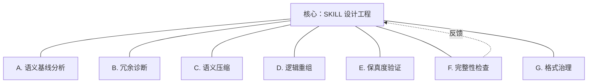
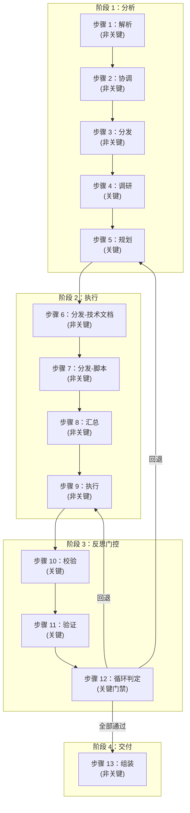
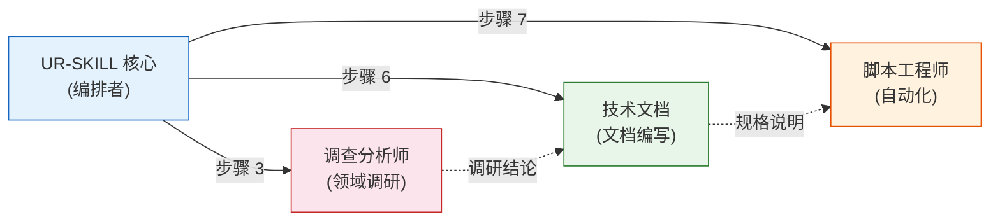

# UR-SKILL

<div align="center">

[](https://github.com/benbird316/UR-SKILL/actions/workflows/validate.yml)
[](https://github.com/benbird316/UR-SKILL/actions/workflows/validate.yml)
[](https://github.com/benbird316/UR-SKILL/actions/workflows/validate.yml)
[](https://www.python.org/)
[](../LICENSE)

**方法论驱动的元技能工厂 — 输入需求，输出生产级 AI Agent 技能包或系统提示词**

</div>

---

**UR-SKILL 将模糊的自然语言需求转化为结构化、可验证的 AI Agent 技能包或系统提示词——项目自身的中英双语翻译、文档校对工作，就是用 UR-SKILL 生产的翻译技能完成的（自吃狗粮）。**

它不是另一个提示词模板。它是一座**工厂**：一套 4 阶段、13 步的验证工作流 × 6 维度审视 × 能力矩阵，系统化地设计、评审并产出生产级技能。生成的技能在交付前通过 15+ 项自动化质量检查。完全符合 [agentskills.io](https://agentskills.io/specification) 开放标准。

---

## 目录

- [太长不看](#太长不看)
- [快速开始](#快速开始)
- [核心概念](#核心概念)
- [目录结构](#目录结构)
- [命令行工具参考](#命令行工具参考)
- [设计理念](#设计理念)
- [贡献指南](#贡献指南)
- [许可证](#许可证)

---

## 太长不看

**痛点**：写系统提示词 或者 Agent 技能 谁都会，但写出**质量稳定、下限有保障**的很难。
- 边界没划清 → 动不动就越界
- 盲区没识别 → 遇到复杂场景就翻车
- 规则有冲突 → AI 不知道该听哪条
- 换个模型就不好用 → 全靠运气试错

**解决方案**：UR-SKILL 不是又一个提示词模板——它是一座**工业级系统提示词 / Agent 技能工厂**。
输入你的需求（"我要一个 XX 角色的 prompt" 或 "帮我生成一个 XX SKILL"），它自动走完 13 步质量门控，输出一套经过能力矩阵设计、6 维度审查、反模式扫描的完整系统提示词或结构化 SKILL 包。个人开发者也能产出大厂级别的质量。

### 为什么选择 UR-SKILL？

| 特性 | 说明 |
|:---|:---|
| **方法论驱动** | 能力矩阵 + 4 阶段验证工作流 + 6 维度审查——设计决策可追溯 |
| **自动化验证** | Python 脚本检查 15+ 质量指标，可配置误报规则 |
| **双语支持** | 中/英双版本，复制即用，适配主流 Agent 平台 |
| **自包含** | 每个技能包独立运行，零外部依赖 |
| **自迭代** | 自吃狗粮——项目自身的中英翻译、文档校对用 UR-SKILL 生成的翻译技能完成 |

### 对比

| 维度 | 手写提示词 | 提示词模板 | 代码生成器 | **UR-SKILL** |
|:---|:---:|:---:|:---:|:---:|
| 结构化设计 | ❌ | ⚠️ | ✅ | ✅ |
| 可验证质量 | ❌ | ❌ | ❌ | ✅ |
| 反模式检测 | ❌ | ❌ | ❌ | ✅ |
| 方法论体系 | ❌ | ❌ | ❌ | ✅ |
| 跨领域复用 | ❌ | ⚠️ | ⚠️ | ✅ |

### 适用人群

#### 核心用户：个人开发者 & 新手

**如果你属于以下情况，UR-SKILL 就是为你设计的：**

- 想给自己的 AI Agent 写一套好用的系统提示词或 SKILL 技能包，但写出来总是质量不稳定
- 不知道「好的系统提示词 / SKILL」应该包含什么——边界在哪？盲区怎么处理？规则冲突了怎么办？
- 看过很多提示词技巧，但拼出来的东西还是「能用但不扎实」，下限没保障
- 想做一个专属技能/角色，但没有大厂提示词工程师的专业方法论
- 不需要什么都懂，只要输入需求，就能产出**工业级标准、有质量下限保证**的系统提示词或结构化 SKILL 包

> **一句话：大厂有专业团队从零设计，你有 UR-SKILL 一键生成。**

#### 进阶用户

| 角色 | 使用场景 | 快速上手 |
|:---|:---|:---|
| **提示词工程师** | 审计现有系统提示词 / SKILL——识别盲区、反模式、边界滥用 | → 粘贴任意技能进行分析 |
| **开源维护者** | 为你的仓库生成 AI Agent 入口，降低 AI 驱动贡献门槛 | → 查看 examples/ 中的真实技能示例 |
| **技术负责人** | 建立团队级技能质量标准，配合 CI 自动化验证门禁 | → 查看命令行工具参考 |

### 什么时候不该用 UR-SKILL

- **你只需要 5 行系统提示词 / 简单技能**——UR-SKILL 的 13 步工作流大材小用，手写即可
- **你的平台不支持子 Agent**——工作流会退化为内联执行，失去并行优化能力
- **你刚接触 AI Agent**——先学习 SKILL/Agent 基础知识，再应用正式方法论
- **你需要的是应用代码，不是 Agent 提示词**——UR-SKILL 产出的是技能定义，不是可运行软件

---

## 快速开始

### 前置条件

- 支持 SKILL 的 AI Agent 平台（Trae / Claude Code / Cursor / Windsurf / CodeBuddy / VS Code Copilot 等）
  - 生成的 SKILL 默认遵循 agentskills.io 开放标准，跨平台兼容
  - 详见 `design-guides/skill-package-design-guide.md §A 平台适配附录`
- Python 3.12+（仅运行验证脚本时需要）

### 三步上手

#### 1. 克隆仓库

```bash
git clone https://github.com/benbird316/UR-SKILL.git
cd UR-SKILL
```

#### 2. 复制 SKILL 包到技能目录

选择语言版本（`UR-SKILL-CN/` 或 `UR-SKILL-EN/`），复制到平台对应的技能目录：

| 平台 | 技能目录位置 |
|:---|:---|
| **Trae** | `%USERPROFILE%\.trae\skills\` 或 `%USERPROFILE%\.trae-cn\skills\` |
| **Claude Code** | `~/.claude/skills/`（Linux/macOS）；`%USERPROFILE%\.claude\skills\`（Windows） |
| **Cursor** | `%APPDATA%\Cursor\User\skills\`（Windows）；`~/.cursor/skills/`（macOS/Linux） |
| **VS Code Copilot** | `.github/skills/`（项目级） |
| **Cline** | `%USERPROFILE%\.cline\skills\` |
| **Windsurf** | `%USERPROFILE%\.windsurf\skills\` |
| **CodeBuddy** | `%USERPROFILE%\.codebuddy\skills\` |
| **界面部署类** | 在平台 UI 中创建新技能，将 `SKILL.md` 内容粘贴进去 |

```bash
# 示例：Windows 上安装中文版到 Trae CN
xcopy UR-SKILL-CN %USERPROFILE%\.trae-cn\skills\ur-skill\ /E /I

# 示例：macOS/Linux 上安装英文版到 Claude Code
cp -r UR-SKILL-EN ~/.claude/skills/ur-skill
```

#### 3. 部署子 Agent

UR-SKILL 的工作流依赖 3 个子 Agent。将这些文件复制到平台的 agents 目录：

```bash
# Trae:
cp UR-SKILL-CN/agent/research-analyst.md .trae/agents/
cp UR-SKILL-CN/agent/tech-documentation.md .trae/agents/
cp UR-SKILL-CN/agent/script-engineer.md .trae/agents/

# Claude Code:
cp UR-SKILL-CN/agent/*.md .claude/agents/

# Cursor:
cp UR-SKILL-CN/agent/*.md .cursor/agents/

# 界面部署类平台：将 agent/ 下各 .md 文件内容分别创建为独立的 agent
# 详见 design-guides/skill-package-design-guide.md §A.5
```

> 如果未部署子 Agent，UR-SKILL 将退化为内联执行模式，不影响核心功能，但会失去并行加速。

### 两大使用方式

#### 方式一：生成系统提示词（最简单，推荐新手从这里开始）

**UR-SKILL 始终走完整的 SKILL 工作流生产技能包。** "系统提示词"是 SKILL 包的输出变体——工作流不变，仅在最后剥离元数据（frontmatter）和引用文件，得到纯文本提示词，可直接复制粘贴到任意平台使用。

> 如何触发：明确要求"系统提示词"即可，UR-SKILL 会自动识别并执行剥离操作。
>
> **关键是说清楚**：`"按照 UR-SKILL 技能要求，生成 XXX 的系统提示词"`

| 子模式 | 触发条件示例 |
|:---|:---|
| **A — 从零生成** | `"按照 UR-SKILL 技能要求，给我生成一个 Python 代码审查的系统提示词"` |
| **B — 优化现有** | `"这是我现在用的 prompt，按照 UR-SKILL 技能要求帮我优化：[粘贴]"` |

> 示例：
> - *"按照 UR-SKILL 技能要求，给我生成一个专门查安全漏洞的代码审查系统提示词"*
> - *"按照 UR-SKILL 技能要求，优化一下我的客服角色 prompt，让它边界感更强"*

> **注意**：如果不显式要求"系统提示词"，UR-SKILL 默认输出完整的 SKILL 包（含能力矩阵、工作流、规则体系、引用文件等），可部署到支持 SKILL 的 Agent 平台。

#### 方式二：生产 SKILL 技能包（进阶）

**产出完整的结构化 SKILL 包**，包含 YAML 元数据、能力矩阵、工作流、规则体系，可直接部署到支持 SKILL 的 Agent 平台，还能附带验证脚本、参考资料等附件。

| 子模式 | 触发条件 | 执行内容 |
|:---|:---|:---|
| **A — 从零生成** | `"我需要一个 Python 安全代码审查 SKILL"` | 完整工作流：调研领域、设计能力矩阵、产出完整技能包 |
| **B1 — 外部技能优化** | 粘贴来自 Cursor / Claude Code / 任意平台的技能 | 拆解现有技能，对照 UR-SKILL 标准差距分析，重建为完整体系 |
| **B2 — 内部技能优化** | `"优化我的 tech-doc-optimizer 技能"` | 6 维度审计、反模式扫描、规则强化，升级已有 UR-SKILL 技能 |
| **C — 知识提取** | `"根据这份文档，生成一个对应领域的 SKILL"` | 读取知识源 → 提取领域事实 → 构建编码该领域知识的技能 |

**无需手动指定模式**——前置分析引擎通过内容特征自动识别路由。

> **平台工具自动适配**：UR-SKILL 在步骤2识别当前运行平台，在步骤10校验工具引用是否正确。指定目标平台时（如"为 Cursor 生成"），引用 [skill-package-design-guide.md §A](design-guides/skill-package-design-guide.md) 的平台映射表完成工具特化；未指定时，LLM 直接感知当前平台可用工具并自动替换。详见 [skill-package-design-guide.md §A](design-guides/skill-package-design-guide.md)。

### 验证生成的技能

```bash
python UR-SKILL-CN/Scripts/validate_skill.py --skill-dir Examples/tech-doc-optimizer --lang zh-cn
```

### 双语一致性检查

```bash
python UR-SKILL-CN/Scripts/bilingual_sync.py
```

---

## 核心概念

### 能力矩阵

核心是**能力矩阵**——1 个核心领域 + 6 个辐射领域，每个领域 4 层深度。这些不是工作流步骤，而是独立的知识领域。



### 验证工作流（4 阶段 × 13 步骤）



关键检查点（调研、规划、校验、验证、循环判定）使用**全部 6 个维度**。非关键检查点使用 3 个维度。

### 6 维度审查

| 维度 | 审查内容 |
|:---|:---|
| **目标对齐** | 输出是否匹配用户需求？ |
| **事实锚定** | 结论是否有依据（非编造）？ |
| **方向校准** | 设计是否偏离核心任务？ |
| **对抗验证** | 从反方视角挑战设计 |
| **盲区识别** | 三层递进：自行修复 → 请求资源 → 盲区报告 |
| **影响推演** | 当前设计决策对后续步骤有何影响？ |

### 渐进式加载

| 层级 | 内容 | Token 预算 |
|:---|:---|:---|
| L1 | YAML frontmatter（名称/描述/元数据） | ~100 tokens |
| L2 | SKILL.md 主体（身份、能力矩阵、工作流、规则） | <5,000 tokens |
| L3 | 参考资料（按需加载：术语表、反模式、故障排除） | 按需加载 |

### 选择技能包模式

UR-SKILL 根据你的需求调整输出：

| 模式 | 内容 | 适用场景 |
|:---|:---|:---|
| **精简版** | 仅 SKILL.md | 快速原型、简单提示词、单概念技能 |
| **标准版** | SKILL.md + references/ | 需要外部标准、术语表或反模式参考的领域技能 |
| **完整版** | 标准版 + scripts/ + assets/ | 含自动化验证、模板或多平台部署的生产级技能 |

UR-SKILL 自动判定模式。如果技能引用外部标准或领域术语，自动添加 references/。如果需要自动化验证或模板，自动包含 scripts/ 和 assets/。

### 多 Agent 架构

UR-SKILL 在协作流水线中编排 3 个专业子 Agent：



| 子 Agent | 角色 | 调用时机 |
|:---|:---|:---|
| **调查分析师** | 领域调研、能力架构、风险分析 | 分析阶段（步骤 2-5） |
| **技术文档工程师** | 技能主体设计、规则编写、格式合规 | 执行阶段（步骤 6） |
| **脚本工程师** | 验证脚本、自动化、CI 集成 | 执行阶段（步骤 7） |

执行阶段子 Agent 并行运行，技术文档和脚本工程师并发工作。

---

## 目录结构

```
UR-SKILL/
├── README.md              # 你在这里
├── CONTRIBUTING.md        # 贡献指南
├── CHANGELOG.md           # 版本历史
├── LICENSE                # Apache 2.0
├── tests/                 # 单元测试（135 项测试）
│   ├── conftest.py
│   ├── test_common.py
│   ├── test_config_loader.py
│   ├── test_validator_format.py
│   ├── test_validator_content.py
│   ├── test_validator_runtime.py
│   ├── test_bilingual_sync.py
│   ├── test_validate_skill.py
│   ├── test_generated_skill.py
│   └── test_self_validate.py
├── Scripts/
│   └── ci_validate_examples.py  # CI 集成测试
├── .github/workflows/
│   └── validate.yml       # CI：自动验证 + 集成测试 + 双语同步检查
│
├── UR-SKILL-CN/           # 中文版（自包含技能包）
│   ├── SKILL.md
│   ├── agent/               # 3 个子 Agent：调查分析师、技术文档、脚本工程师
│   ├── templates/           # 生成技能的模板
│   ├── design-guides/       # 设计方法论指南
│   ├── References/          # 术语表 + 反模式 + 故障排除
│   ├── design-rationale/    # 设计原理解释
│   ├── examples/            # 示例
│   └── Scripts/             # 验证 + 同步脚本

├── UR-SKILL-EN/           # 英文版（自包含；agent/ 为合并的单 SKILL.md）
│
└── Examples/              # UR-SKILL 生成的生产级技能
    ├── cn-en-tech-translator/   # 中译英技术文档翻译技能（自吃狗粮：项目自身双语翻译即用它完成）
    ├── tech-doc-optimizer/
    └── web-research-analyst/
```

**关键设计决策**：
- 中文版和英文版是**独立、自包含的技能包**——可单独使用任意一个
- `bilingual_sync.py` 确保中英文目录结构一致性
- `tests/` 是覆盖两种语言配置的单一测试套件，`ci_validate_examples.py` 端到端验证完整流程

---

## 命令行工具参考

### `validate_skill.py`

| 参数 | 说明 | 示例 |
|:---|:---|:---|
| `--skill-dir <path>` | 技能包目录路径 | `--skill-dir UR-SKILL-CN` |
| `--lang zh-cn\|en-us` | 验证规则语言 | `--lang zh-cn` |
| `--format text\|json` | 输出格式 | `--format json` |

### `bilingual_sync.py`

检查中/英目录间的结构一致性：

```bash
python UR-SKILL-CN/Scripts/bilingual_sync.py
```

---

## 设计理念

1. **方法论优先，而非模板优先**——模板用来填充；方法论指导如何填充
2. **渐进式加载**——U 型注意力曲线；三层加载将信息放在最优位置
3. **规则驱动（RFC 2119）**——MUST/SHOULD/MAY 分级，无模糊建议
4. **盲区三层递进**——自行修复 → 请求资源 → 盲区报告；不可越级
5. **身份谦逊**——研究证实「专家」「多年经验」等标签会降低模型表现

---

## 贡献指南

欢迎贡献！完整指南见 [CONTRIBUTING.md](../CONTRIBUTING.md)。

```bash
# 贡献者快速上手
git clone https://github.com/benbird316/UR-SKILL.git
cd UR-SKILL
pip install pyyaml pytest
python -m pytest tests/ -v
python UR-SKILL-CN/Scripts/validate_skill.py --skill-dir UR-SKILL-CN --lang zh-cn
```

所有 PR 合并前必须通过验证。

---

## 许可证

[Apache 2.0](../LICENSE)——保护方法论不被闭源重分发并冠以同名，同时保持足够宽松供社区自由使用。

---

## 致谢

- [Anthropic](https://www.anthropic.com/)——Claude 平台与 SKILL 概念
- [RFC 2119](https://www.ietf.org/rfc/rfc2119.txt)——规则分级关键词标准
- USC ICT & Wharton——身份膨胀对 LLM 表现影响的研究
